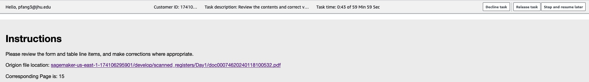

# Reviewing Memo
## Entry URL for the Review
https://ljcc3rm9md.labeling.us-east-1.sagemaker.aws  
If you don't have an account for logging, please contact pfang3@jhu.edu. Once you log in, you will see all the register books that need human verification.

## Introduction & Purpose

The purpose of this task is to correct digitalized data from handwritten registers. The data has already been digitalized through use of a tool that aims to identify handwritten letters and characters within printed tables and recreate those tables with the information included within the tables. This tool, however, is not always accurate. The process you are being asked to assist with is to review the output of that tool and correct it where it has not, to the best of your judgement, accurately represented the text or characters within the table. 

## Instructions

In order to better assist you in your task, here are some guiding principles for the manual review of the data:

1.	The goal of the task is to accurately capture what is written. If something is already accurately captured, there is no need to re-enter the data.
2.	If a portion of the paper table is not filled out (the cell is blank or there is a horizontal line written in the cell like so);
   the acceptable textract output is **-** or **nan**. If there are any other, it should be corrected to “nan”.
3.	Review should be done in whatever fashion is most efficient for you, but it is recommended to review vertically, going column by column rather than row by row.
4.	Certain fields have a set list of possible values. Importantly, there is a finite list of possible Quartiers and Avenues that will be written, and they have known relationships (i.e., certain Avenues will only be found alongside certain Quartier values and vice versa). We have provided a list of Quartiers and the Avenues that are within that Quartier (*see below*). It is not required that you use this, but if you are unsure of the spelling of a value for Quartier or Avenue, you may reference the list to determine the true value of the cell.
5.	When accepting tasks, try to completely finish one task before moving onto another.
6.  For column **Prenom**, **Nom**, **Postnom** and **Chef de Menage**, *every* textract's output should be checked. 
7.	If the tables in the task do not have the correct dimensions, have unintelligible columns or overall have some issue that makes completeing the task with the given instructions difficult or impossible, please ask questions in the **uvira_2023_vaccination_campaign** Slack channel and make a comment on one of the rows.

Complete the tables to the best of your ability, and click “Submit” when you have finished. If there are errors that you realize need to be corrected or you a missed a correction, please note the name of the task and alert either Jules or Pengcheng in the **uvira_2023_vaccination_campaign** Slack channel.

Thank you!

## UI Description

There are three important tabs on the top right of the above figure. Every review page has the same three tabs at the very beginning. 
1. **Decline task**: Don't click this one.  It will teminerate the current task, no one else can work it anymore.
2. **Release task**: If you don't want to work on current page or register anymore, you should click this tab. AWS will automaticlly post this page to other reviewers who is reviewing this book.
3. **Stop and Resume Later**: You can take this as a save button. Once you click this tab, AWS will save your current progress and make you back to the unfinished book list. 

## Valid Values for Quartier and Avenue

| Quartier    | Avenue                                                                                                                                                                                                                                                                                                                                                                                                                                                                                                                                                                                   |
|-------------|------------------------------------------------------------------------------------------------------------------------------------------------------------------------------------------------------------------------------------------------------------------------------------------------------------------------------------------------------------------------------------------------------------------------------------------------------------------------------------------------------------------------------------------------------------------------------------------|
| Autre/Other | Hebron, Kadota, Muteremuko, Talatala, Village Kabindula                                                                                                                                                                                                                                                                                                                                                                                                                                                                                                                                  |
| Kabindula   | Elimu, Kalimabenge, Kashekebwe, Kijaga, Kimbangu, Kirambo, Maombi, Musabwa, Musohoko                                                                                                                                                                                                                                                                                                                                                                                                                                                                                                     |
| Kakombe     | Bavi, Cinq Chantiers, Du Peuple, Goma, Kakombe, Kalundu, Kalungwe, Kamanyola, Kasavubu, Kavuye, Kigongo, Kitundu, Kivu, Kivu Sud, Lenghe Iii, Likasi, Lukula, Maendeleo Sud, Membo, Mont Ngaliema, Mukulima, Musulmane, Nakaziba, Nyakyoya, Nyatutwa, Reboisement, Sange, Shaba, Simba, Ubwari, Ujuzi, Virunga                                                                                                                                                         |
| Kalundu     | Bongisa, Centre Commercial, Du Port, Kagenge, Kakamba, Kamongola, Karigo, Kasia, Kinogono 1, Kinogono 2, Mutarure (mutarule), Ngovi Mgja, Nyoroka 1, Nyoroka 2, Rugembe, Solange, Umoja                                                                                                                                                                                                                                                                                                                                                                                                  |
| Kasenga     | Amani, Azuhuri, Bondogolo, Budota, Bukavu, Conforti (Mangondo 2), Du General (Kiyaya Centre), Du Port, Ginki, Hebroni, Hewa Bora, Kabomboza, Kasablanca, Kasenga Centre, Kigobe, Kikula, Kilima Hewa, Kisangani, Kitumaini, Kivu Nord, Kiyaya Ouest, Lala Salama, Maendeleo, Majengo, Mangondo (Mangondo 1), Mapendo, Muranvya, Musheru, Muungano, Mwangaza, Petit Pont, Regezamwendo, Salongo, Tanganyika, Tupendane, Umoja, Universite (Kiyaya Nord), Uwezo, de la Gombe, de la Mosquee |
| Kavimvira   | Cpgl, Du Lac, Du Marche, Du Projet, Kalembelembe, Kamanyola, Kasavubu, Kimbangu, Lumumba, Maiyamoto, Mapendo, Mobutu, Ndava, Nyangara, Rond Point, Rubenga, Tanganyika, Tupendane, de la Plage                                                                                                                                                                                                                                                                                                                                                 |
| Kibondwe    | Bajoba, Bushoga, Kabego, Kitunya, Mushule, Reboisement Kib                                                                                                                                                                                                                                                                                                                                                                                                                                                                                                                               |
| Kilibula    | Kyonga, Lenghe Iii, Maendeleo, Mombasa, Shaba                                                                                                                                                                                                                                                                                                                                                                                                                                                                                                                                            |
| Kimanga     | Du Pionnier, Du Stade, Kabungulu 1, Kabungulu 2, Kimanga, Nyamianda 1 (Du Congo 1), Nyamianda 2 (Du Congo 2), de la Paix                                                                                                                                                                                                                                                                                                                                                                                                                                                                 |
| Mulongwe    | Apollo 1, Apollo 2, Kasavubu, Kayaja 1 2 3 4, Kitunge, Lumumba, Makobola, Matadi 1, Matadi 2, Mitumba 1 2 3, Rwegereza, Shishi 1, Shishi 2, Shishi 3, Shishi 4, Yohana, de la Cite                                                                                                                                                                                                                                                                                                                                                                                                       |
| Nyamianda   | Alliance, Embouchure, Goma, Isiro, Kivu, Lumbulumbu, Munanira, Mundi, Musumba, Plage D Or                                                                                                                                                                                                                                                                                                                                                                                                                                                                                                |
| Rombe I     | Bas Congo, Bralima 1, Bralima 2, De L Authenticite, Du 04 Janvier, Du 15 Decembre, Du 24 Novembre, Du 27 Octobre, Du 30 Juin, Fac, Fizi, Haut Congo, Kabare, Kakungwe 1, Kakungwe 2, Kakungwe 3, Kalehe, Major Vangu, Mulongwe, Munanira, Mwenga, Shabunda, Uvira, Walungu                                                                                                                                                                                                                                                                                                               |
| Rombe II    | Baraka (Idjwi 2), Bas Congo, De L Authenticite, De L Orthodoxe (Idjwi 3), Du 04 Janvier, Du 15 Decembre, Du 24 Novembre, Du 27 Octobre, Du 30 Juin, Fac, Fizi, Haut Congo, Idjwi (Idjwi 1), Kabare, Kalehe, Major Vangu, Mulongwe, Munanira, Mwenga, Shabunda, Uvira, Walungu                                                                                                                                                                                                                                                                                                            |
| Rugenge     | Kinaga, Maendeleo, Makarunga, Petrocongo, Rugenge Nord, Rugenge Sud, Ushirika, de la Paroisse                                                                                                                                                                                                                                                                                                                                                                                                                                                                                            |
| Songo       | Alliance, Alpha, Democratie, Du 17 Mai, Du Marche, Du Progres, Du Stade, Lumumba, Maendeleo, Mapendano, Mapinduzi, Matumaini, Umoja, de la Mission, de la Paix                                                                                                                                                                                                                                                                                                                                                                                                                           |
