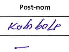

# Reviewing Memo
## How None value is coded?
1.  **\-** represents an empty value. This corresponding table cell in register is shown in Fig 1.   
   
2. **nan** represents an empty value. 
## Valid Values for Quartier and Avenue

| Quartier    | Avenue                                                                                                                                                                                                                                                                                                                                                                                                                                                                                                                                                                                   |
|-------------|------------------------------------------------------------------------------------------------------------------------------------------------------------------------------------------------------------------------------------------------------------------------------------------------------------------------------------------------------------------------------------------------------------------------------------------------------------------------------------------------------------------------------------------------------------------------------------------|
| Autre/Other | Hebron, Kadota, Muteremuko, Talatala, Village Kabindula                                                                                                                                                                                                                                                                                                                                                                                                                                                                                                                                  |
| Kabindula   | Elimu, Kalimabenge, Kashekebwe, Kijaga, Kimbangu, Kirambo, Maombi, Musabwa, Musohoko                                                                                                                                                                                                                                                                                                                                                                                                                                                                                                     |
| Kakombe     | Bavi, Cinq Chantiers, Du Peuple, Goma, Kakombe, Kalundu, Kalungwe, Kamanyola, Kasavubu, Kavuye, Kigongo, Kitundu, Kivu, Kivu Sud, Lenghe Iii, Likasi, Lukula, Maendeleo Sud, Membo, Mont Ngaliema, Mukulima, Musulmane, Nakaziba, Nyakyoya, Nyatutwa, Reboisement, Sange, Shaba, Simba, Ubwari, Ujuzi, Virunga                                                                                                                                                         |
| Kalundu     | Bongisa, Centre Commercial, Du Port, Kagenge, Kakamba, Kamongola, Karigo, Kasia, Kinogono 1, Kinogono 2, Mutarure (mutarule), Ngovi Mgja, Nyoroka 1, Nyoroka 2, Rugembe, Solange, Umoja                                                                                                                                                                                                                                                                                                                                                                                                  |
| Kasenga     | Amani, Azuhuri, Bondogolo, Budota, Bukavu, Conforti (Mangondo 2), Du General (Kiyaya Centre), Du Port, Ginki, Hebroni, Hewa Bora, Kabomboza, Kasablanca, Kasenga Centre, Kigobe, Kikula, Kilima Hewa, Kisangani, Kitumaini, Kivu Nord, Kiyaya Ouest, Lala Salama, Maendeleo, Majengo, Mangondo (Mangondo 1), Mapendo, Muranvya, Musheru, Muungano, Mwangaza, Petit Pont, Regezamwendo, Salongo, Tanganyika, Tupendane, Umoja, Universite (Kiyaya Nord), Uwezo, de la Gombe, de la Mosquee |
| Kavimvira   | Cpgl, Du Lac, Du Marche, Du Projet, Kalembelembe, Kamanyola, Kasavubu, Kimbangu, Lumumba, Maiyamoto, Mapendo, Mobutu, Ndava, Nyangara, Rond Point, Rubenga, Tanganyika, Tupendane, de la Plage                                                                                                                                                                                                                                                                                                                                                 |
| Kibondwe    | Bajoba, Bushoga, Kabego, Kitunya, Mushule, Reboisement Kib                                                                                                                                                                                                                                                                                                                                                                                                                                                                                                                               |
| Kilibula    | Kyonga, Lenghe Iii, Maendeleo, Mombasa, Shaba                                                                                                                                                                                                                                                                                                                                                                                                                                                                                                                                            |
| Kimanga     | Du Pionnier, Du Stade, Kabungulu 1, Kabungulu 2, Kimanga, Nyamianda 1 (Du Congo 1), Nyamianda 2 (Du Congo 2), de la Paix                                                                                                                                                                                                                                                                                                                                                                                                                                                                 |
| Mulongwe    | Apollo 1, Apollo 2, Kasavubu, Kayaja 1 2 3 4, Kitunge, Lumumba, Makobola, Matadi 1, Matadi 2, Mitumba 1 2 3, Rwegereza, Shishi 1, Shishi 2, Shishi 3, Shishi 4, Yohana, de la Cite                                                                                                                                                                                                                                                                                                                                                                                                       |
| Nyamianda   | Alliance, Embouchure, Goma, Isiro, Kivu, Lumbulumbu, Munanira, Mundi, Musumba, Plage D Or                                                                                                                                                                                                                                                                                                                                                                                                                                                                                                |
| Rombe I     | Bas Congo, Bralima 1, Bralima 2, De L Authenticite, Du 04 Janvier, Du 15 Decembre, Du 24 Novembre, Du 27 Octobre, Du 30 Juin, Fac, Fizi, Haut Congo, Kabare, Kakungwe 1, Kakungwe 2, Kakungwe 3, Kalehe, Major Vangu, Mulongwe, Munanira, Mwenga, Shabunda, Uvira, Walungu                                                                                                                                                                                                                                                                                                               |
| Rombe II    | Baraka (Idjwi 2), Bas Congo, De L Authenticite, De L Orthodoxe (Idjwi 3), Du 04 Janvier, Du 15 Decembre, Du 24 Novembre, Du 27 Octobre, Du 30 Juin, Fac, Fizi, Haut Congo, Idjwi (Idjwi 1), Kabare, Kalehe, Major Vangu, Mulongwe, Munanira, Mwenga, Shabunda, Uvira, Walungu                                                                                                                                                                                                                                                                                                            |
| Rugenge     | Kinaga, Maendeleo, Makarunga, Petrocongo, Rugenge Nord, Rugenge Sud, Ushirika, de la Paroisse                                                                                                                                                                                                                                                                                                                                                                                                                                                                                            |
| Songo       | Alliance, Alpha, Democratie, Du 17 Mai, Du Marche, Du Progres, Du Stade, Lumumba, Maendeleo, Mapendano, Mapinduzi, Matumaini, Umoja, de la Mission, de la Paix                                                                                                                                                                                                                                                                                                                                                                                                                           |